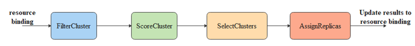

# karmada scheduler refactor

## Overview

随着karmada的逐步发展，社区上对于多集群的资源调度的场景诉求也越来越多;目前现有的karmada调度器并不能很好的支撑各种业务场景。<br>
目前从社区issue上已经看到的类似的功能场景诉求
- 不支持集群被移除的场景[issue #829](https://github.com/karmada-io/karmada/issues/829)
- failOverScheduling不支持spread constraint[issue #1258](https://github.com/karmada-io/karmada/issues/1258)
- support preferred cluster affinity [issue #780](https://github.com/karmada-io/karmada/issues/780)

我们发现在分析上述issue的时候，当前karmada的Scheduler模块流程架构上存在一些问题：
- 调度流程结构不合理
  - 针对集群异常场景，定制了一套新的调度流程接口FailoverSchedule，后续再扩展功能点时， 就需要考虑多个调度流程
- 调度流程模块职责不单一
  - 在assignReplicas阶段除了副本分配职责外，还进行集群的优选工作， 后续再扩展优选功能点时， 开发者不能很清晰的知道

为了后续开发新的调度特性更加的清晰，本次这里对整个调度流程进行梳理。

## Motivation

本次我们主要是为了明确调度流程模型以及每一个调度流程的定义与功能逻辑。同时考虑当前以及近期需要实现的业务场景

### Goals

- 明确调度流程模型以及每一个调度流程模块的职责与接口，便于新增功能的开发
- 重构assignReplicas， 定义分配策略模板接口，为后续新增分配策略提供框架
- spreadConstraint支持provider、region、zone, 仅支持minGroup=maxGroup

### Non-Goals
- spreadConstraint的provider、region、zone配置支持范围设置

## Proposal

### 当前调度机制



当前的调度流程主要分为上述的4个流程模块，但是在模块实现上存在功能不生效、职责不单一、相互混淆的问题。

下面针对每一个存在一定问题的流程进行分析

#### FilterCluster
该模块意图在于给集群进行过滤，过滤掉不满足条件的集群；
没有存在结构性问题，职责清晰
#### ScoreCluster

该模块意图在于给集群打分，希望在后续选取集群的时候，优先选取得分高的集群进行副本分配

目前存在如下几个问题
- ScoreCluster的结果数据并没有作用到后续的流程中
- 现有接口中没有定义归一化的接口，只有一个简单的Score的接口， 不能满足集群间相互影响打分的场景

#### SelectClusters
该模块意图在于选取一定量的集群，进行后续的副本分配

目前存在如下几个问题
- 没有使用ScoreCluster的结果数据进行集群的选择，导致集群选取的不可预期
- 当没有配置spreadConstraint时，没有进行集群的选择而是由AssignReplicas自行选择集群， 并没有履行其职责
- 没有支持provider、region、zone的分配约束

#### AssignReplicas
该流程在于将作业副本按照配置的分配策略分配到SelectClusters选取的集群上

目前存在如下几个问题
- 实现中除了进行了作业副本的分配，也进行了集群的优选逻辑与SelectClusters、ScoreCluster存在功能重叠
- 该模块的代码结构没有预留新增副本分配算法的接口，即没定义好新增副本分配算法的模板与流程

综合上述分析， 进行如下具体的设计

## Design Details

### 定义调度流程接口

每一步的流程的输出必须与下一个流程具有衔接性，即作为下一步的入参数据

````
	// 1. filter clusters
	FilterClusters(ctx context.Context, spec *workv1alpha2.ResourceBindingSpec， placement *policyv1alpha1.Placement,
	    cluster []*clusterv1alpha1.Cluster) []*clusterv1alpha1.Cluster{}
    
	// 2. Scoring feasible Clusters 
	ScoreClusters(ctx context.Context, feasibleClusters []*clusterv1alpha1.Cluster,
	    placement *policyv1alpha1.Placement) ClusterScoreList{}
	    
    // 3. select cluster for workload
	SelectClusters(scoreList ClusterScoreList, spec *workv1alpha2.ResourceBindingSpec,
	    strategy *policyv1alpha1.ReplicaSchedulingStrategy) []*clusterv1alpha1.Cluster{}
	
	// 4. assign replicas
	AssignReplicas(cluster []*clusterv1alpha1.Cluster, spec *workv1alpha2.ResourceBindingSpec,
	    strategy *policyv1alpha1.ReplicaSchedulingStrategy) []TargetCluster{}
````

#### FilterCluster
该流程主要是过滤一些不符合过滤插件的cluster

后续对于过滤cluster的功能， 可以通过在该流程中添加
目前已实现的过滤插件如下：
- ClusterAffinity<br>
  checks if the cluster is met with the propagation policy about the cluster affinity
- APIInstalled<br>
  checks if the API(CRD) of the resource is installed in the target cluster.
- TaintToleration<br>
  checks if the propagation policy tolerates a cluster's taints
  
本次重构中会新增如下的过滤功能的插件

- 集群资源相关的过滤<br>
  - 分配策略配置为duplicated时，查看集群的资源量是否满足作业的资源请求<br>
      
  后续集群资源相关的过滤功能，可以在该插件中添加

如下为过滤插件接口的定义
````
// Plugin is the parent type for all the scheduling framework plugins.
type Plugin interface {
	Name() string
}

// FilterPlugin is an interface for filter plugins. These filters are used to filter out clusters
// that are not fit for the resource.
type FilterPlugin interface {
	Plugin
	// Filter is called by the scheduling framework.
	Filter(ctx context.Context, placement *policyv1alpha1.Placement, spec *workv1alpha2.ResourceBindingSpec, cluster *clusterv1alpha1.Cluster) *Result
}
````
#### ScoreCluster
该流程主要是对经过FilterCluster流程后的集群进行打分。<br>
当前现有代码中没有该优选功能的具体实现,当前社区上已经存在一些用户有相关的功能述求，如下
 - 基于cluster可用资源的优选
 - 针对重调度场景的优选
 - 针对分配策略的优选

如下为打分插件的定义
````
// ScorePlugin is an interface that must be implemented by "Score" plugins to rank
// clusters that passed the filtering phase.
type ScorePlugin interface {
	Plugin
	// Score is called on each filtered cluster. It must return success and an integer
	// indicating the rank of the cluster. All scoring plugins must return success or
	// the resource will be rejected.
	Score(ctx context.Context, placement *policyv1alpha1.Placement, spec *workv1alpha2.ResourceBindingSpec, clusterv1alpha1 *clusterv1alpha1.Cluster) (float64, *Result)
	
	// ScoreExtensions returns a ScoreExtensions interface if it implements one, or nil if does not.
	ScoreExtensions() ScoreExtensions
}

// ScoreExtensions is an interface for Score extended functionality.
type ScoreExtensions interface {
	// NormalizeScore is called for all cluster scores produced by the same plugin's "Score"
	// method. A successful run of NormalizeScore will update the scores list and return
	// a success status.
	NormalizeScore(ctx context.Context, scores ClusterScoreList) *Result
}

// ClusterScore represent the cluster score.
type ClusterScore struct {
	Cluster *clusterv1alpha1.Cluster
	Score float64
}

// ClusterScoreList declares a list of clusters and their scores.
type ClusterScoreList []ClusterScore


````
后续会存在一些优选插件的得分需要归一化处理，因此这里除了Score接口外， 定义了NormalizeScore接口用于归一化
#### GroupClustersWithScore
该流程进行cluster信息整理,为后续的SelectCluster流程做准备

每一个clsuter都有对应唯一的Provider、Region、Zone，基于这一特性对集群进行归类明确如下的信息,最终返回GroupClustersInfo结构信息
- 每一个provider有哪些region、zone、cluster以及对应的可用资源量以及得分
- 每一个region有哪些zone、cluster以及对应的可用资源量以及得分
- 每一个zone有哪些cluster以及对应的可用资源量以及得分

收集完成后， 则根据其中的Score进行递减排序
##### 新增结构体 GroupClustersInfo

````
type GroupClustersInfo struct {
	// Providers from globally view, sorted by providers.Score descending.
	Providers []ProviderInfo
	// Regions from globally view, sorted by region.Score descending.
	Regions []RegionInfo
	// Zones from globally view, sorted by zone.Score descending.
	Zones []ZoneInfo
	// Clusters from globally view, sorted by cluster.Score descending.
	Clusters []ClusterInfo
}

type ProviderInfo struct {
	Name              string
	Score             int64
	AvailableReplicas int64

	// Regions under this provider, sorted by region.Score descending.
	Regions []RegionInfo
	// Zones under this provider, sorted by zone.Score descending.
	Zones []ZoneInfo
	// Clusters under this provider, sorted by cluster.Score descending.
	Clusters []ClusterInfo
}

type RegionInfo struct {
	Name              string
	Score             int64
	AvailableReplicas int64

	// Zones under this region, sorted by zone.Score descending.
	Zones []ZoneInfo
	// Clusters under this region, sorted by cluster.Score descending.
	Clusters []ClusterInfo
}

type ZoneInfo struct {
	Name              string
	Score             int64
	AvailableReplicas int64

	RegionName   string
	ProviderName string

	// Clusters under this zone, sorted by cluster.Score descending.
	Clusters []ClusterInfo
}

type ClusterInfo struct {
	Name              string
	Score             int64
	AvailableReplicas int64

	Cluster *clusterv1alpha1.Cluster
}
````

这里有可能会存在cluster上没有填写Provider、Region、Zone中一个或者多个信息的情况

假如cluster上没有某一个字段，则该字段默认设置为default；比如cluster上没配置zone， 则该cluster对应的zone为default, 该default zone的Score为0

#### SelectClusters

对于不同的分配策略，选取集群逻辑存在不同

- 针对配置策略divide.staticWeight, 其TargetCluster字段本身已经带有了选择集群的约束属性，因此直接根据它进行集群的选择即可
- 针对duplicated以及aggregated、dynamicWeight， 则需要考虑spreadConstraint配置

因此这里对不同的策略定义一套选择集群的方案，
经过上述流程GroupClustersWithScore得到一个类似于拓扑结构的集群分组信息，本流程基于该信息进行cluster的选择。

##### 针对常规调度流程

**集群选取**

假如没有配置spreadConstraint， 则直接按照cluster优先级依次选择cluster直到满足作业的资源请求

假如配置了spreadConstraint， 选择集群时，综合考虑每一个cluster、zone、provider的Score、AvailableReplica<br>

选择的原则为：
- 必须满足配置的spreadConstraint
- 尽量以Score维度为准，优先选取得分高的provider、region、zone、cluster
- 最终选择的clusters必须满足作业的资源请求，即cluster的availableReplica总和要大于作业的副本数

目前的选择逻辑基于回溯的方式进行
1. 选取一个得分最高的cluster
2. 判断是否满足provider spreadConstraint，如果不满足， 则按照provider的得分依次选取足够的个数直至满足，并取每一个provider下clusterScore最高的cluster
3. 判断是否满足region spreadConstraint，如果不满足， 则在上述的provider下的所有region中按照得分选取足够的个数直至满足，并取每一个region下clusterScore最高的cluster
4. 判断是否满足zone spreadConstraint，如果不满足， 则在上述的region下的所有zone中按照得分选取足够的个数直至满足，并取每一个zone下clusterScore最高的cluster
5. 判断是否满足cluster spreadConstraint，如果不满足， 则在上述的zone下的所有cluster中按照得分选取足够的个数直至满足cluster spreadConstraint
6. 判断当前选取的cluster的AvailableReplica是否满足作业的资源请求，如果不满足，则将zone下的所有剩余的cluster按照availableReplica从大到小排序，依次替换优先级低的cluster(需要满足zone的spreadConstraint)
7. 步骤6最终没有结果，则回溯到步骤4，选取下一个满足zonespreadConstraint的zone组合
8. 如果所有zone的组合也没有满足， 则同理回溯到步骤3，选取下一个region组合
9. 如果所有region的组合也没有满足，  则同理回溯到步骤3，选取下一个provider组合
10. 如果所有provider的组合也没有满足， 则说明没有满足条件的clusters，

具体的实现可以优化， 选择原则必须遵守
##### 针对分配策略为divide.staticWeight的调度流程
1. 依次判断cluster是否满足staticWeightRule的cluster， 如果不满足则过滤， 满足则保存；
2. 假如步骤1中没有cluster满足staticWeightRule， 则将所有的cluster传递下下一个子流程AssignReplicas


#### AssignReplicas
该流程则根据配置的副本调度策略进行副本的分配工作

目前存在如下的分配策略
- Duplicate
- Divide.staticWeight
- Divide.dymanicWeight
- Divide.aggregated

采用工厂模式进行重构； 新增分配策略时， 不会影响主流程以及其他分配策略逻辑
````
type AssignReplicaInterface interface {
  Name() string
  AssignReplica(object *workv1alpha2.ResourceBindingSpec, clusters []*clusterv1alpha1.Cluster) ([]workv1alpha2.TargetCluster, error)
}

// RegisterAssignReplicaFunc register a replicaScheduling strategy
func RegisterAssignReplicaFunc(name string, interface AssignReplicaInterface)

// GetAssignReplica return a AssignReplicaInterface object besed the ReplicaSchedulingStrategy configuration
func GetAssignReplica(strategy *policyv1alpha1.ReplicaSchedulingStrategy) AssignReplicaInterface
````
主体流程则
````
apObj := GetAssignReplica(strategy)
apObj.AssignReplica()
````
比如新增一个新的分配策略时只需要实现如下

````
type strategy_XXX struct {
}
func init () {
    RegisterAssignReplicaFunc(strategyName, &strategy_XXX{})
}

func (st strategy_XXX) Name() string {
  ...
}

func (st strategy_XXX) AssignReplica(object *workv1alpha2.ResourceBindingSpec, clusters []*clusterv1alpha1.Cluster) ([]workv1alpha2.TargetCluster, error)
  ...
}

````

## Constraints
- divide.staticWeight与spreadConstraint同时配置时， spreadConstraint不生效，仅divide.staticWeight配置生效
- 为了spreadConstraint的cluster minGroup和maxGroup差值不超过10

#### 
### Test Plan

<!--
**Note:** *Not required until targeted at a release.*

Consider the following in developing a test plan for this enhancement:
- Will there be e2e and integration tests, in addition to unit tests?
- How will it be tested in isolation vs with other components?

No need to outline all of the test cases, just the general strategy. Anything
that would count as tricky in the implementation, and anything particularly
challenging to test, should be called out.

-->

## Alternatives

<!--
What other approaches did you consider, and why did you rule them out? These do
not need to be as detailed as the proposal, but should include enough
information to express the idea and why it was not acceptable.
-->

<!--
Note: This is a simplified version of kubernetes enhancement proposal template.
https://github.com/kubernetes/enhancements/tree/3317d4cb548c396a430d1c1ac6625226018adf6a/keps/NNNN-kep-template
-->